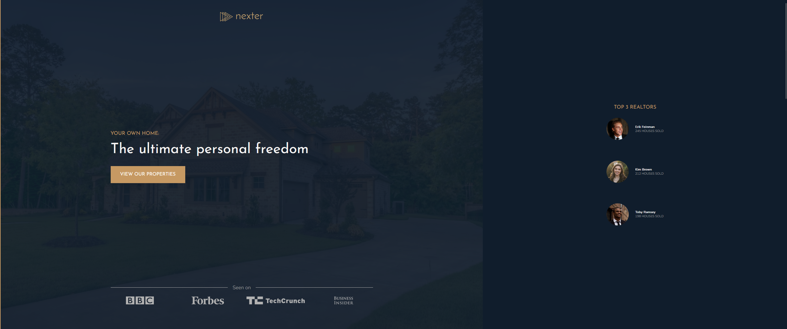
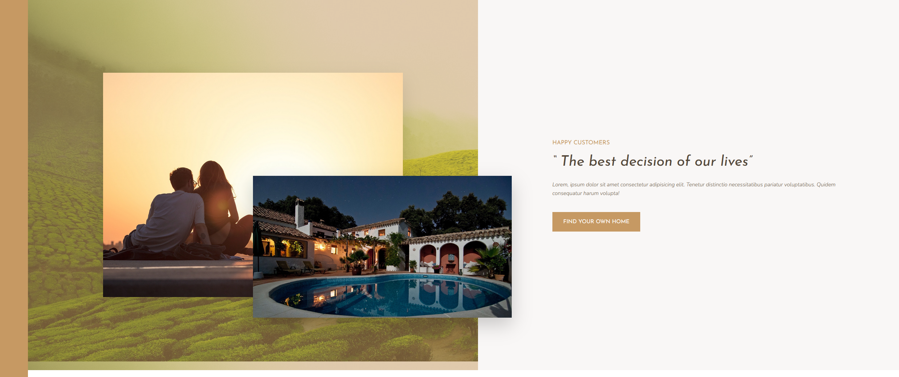
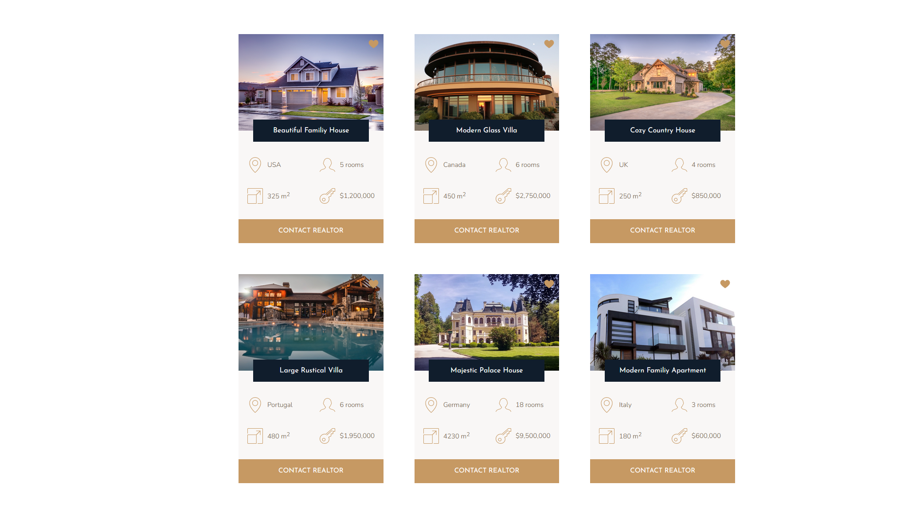
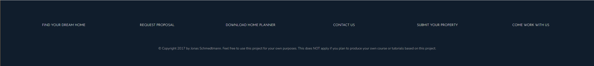

# nexter-project

This project was part of Jonas Schmedtmann's Advances CSS & SASS course on Udemy.

- CSS
- SASS
    - Nesting,
    - **Grid**: primary objective of this project
        - `grid-template-columns` & `grid-template-rows`
        - `grid-auto-rows`
        - `auto-fit`
        - `grid-gap`
        - Grid custom names
        - Alignment: `justify-content`, `align-items`, `align-self`
- Media queries, responsive layouts
- CSS Functions: `min`, `minmax` (Grid only),
- Basic CSS reset
- Chrome DevTools & Debugging
- Git Fundamentals
- When to use flex vs grid properties 

## Screenshots

> Normal View / Desktop Layout

